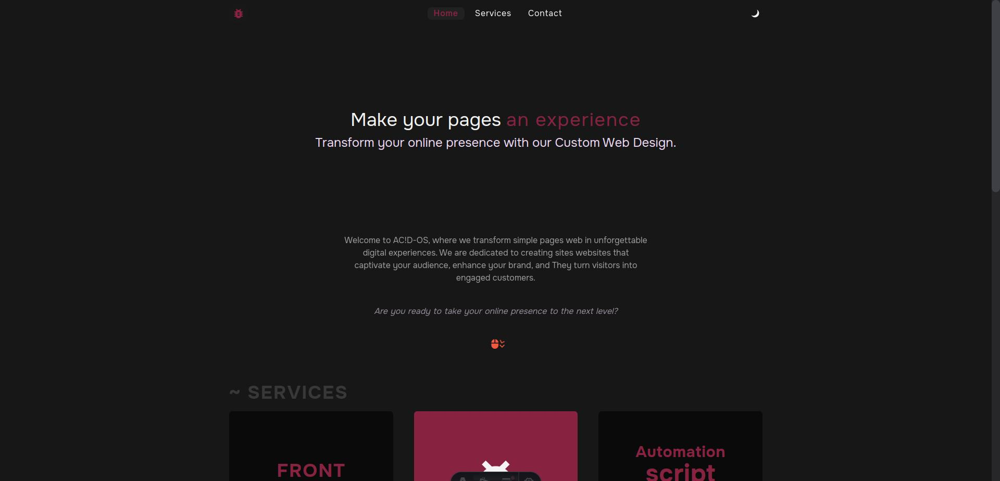

# ⚡ web-services-page

[](https://web-services-page.vercel.app/)

<div style="display:flex;gap:40px">
  
  
</div>

## Project Structure

```text
├── public/
├── src/
│   ├── components/
│   |   ├── contact/
│   |   ├── header/
│   |   ├── home/
│   |   └── services/
│   ├── hooks/
│   ├── icomoon/
│   ├── layouts/
│   ├── pages/
│   ├── services/
│   └── validations/
├── astro.config.mjs
├── README.md
├── package.json
├── tailwind.config.mjs
└── tsconfig.json
```

## Commands

All commands are run from the root of the project, from a terminal:

| Command                   | Action                                           |
| :------------------------ | :----------------------------------------------- |
| `npm install`             | Installs dependencies                            |
| `npm run dev`             | Starts local dev server at `localhost:3000`      |
| `npm run build`           | Build your production site to `./dist/`          |
| `npm run preview`         | Preview your build locally, before deploying     |
| `npm run astro ...`       | Run CLI commands like `astro add`, `astro check` |
| `npm run astro -- --help` | Get help using the Astro CLI                     |
